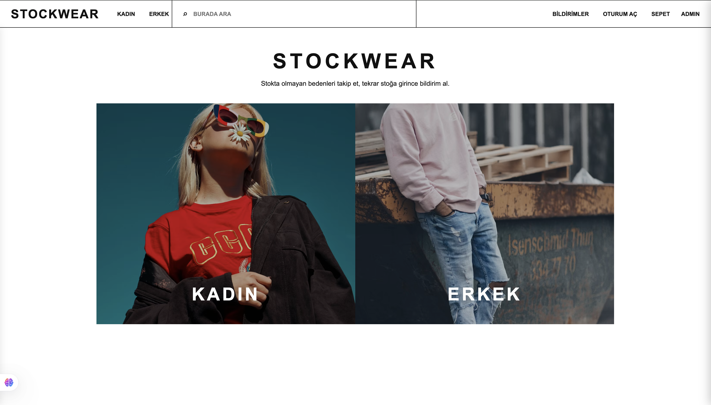
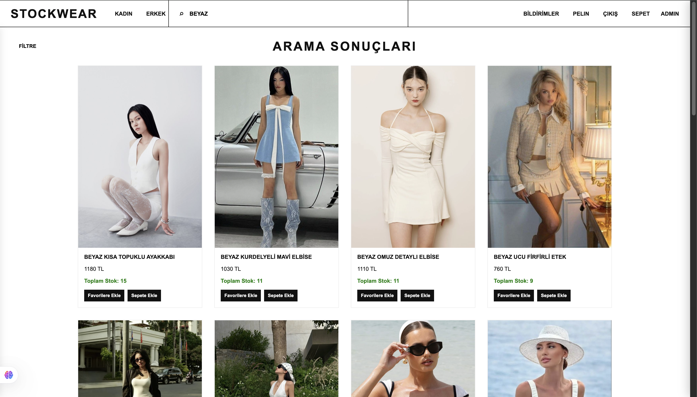
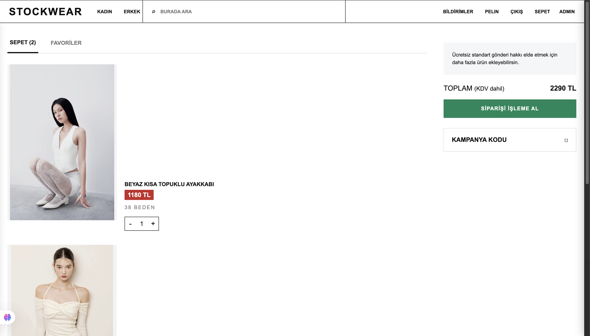
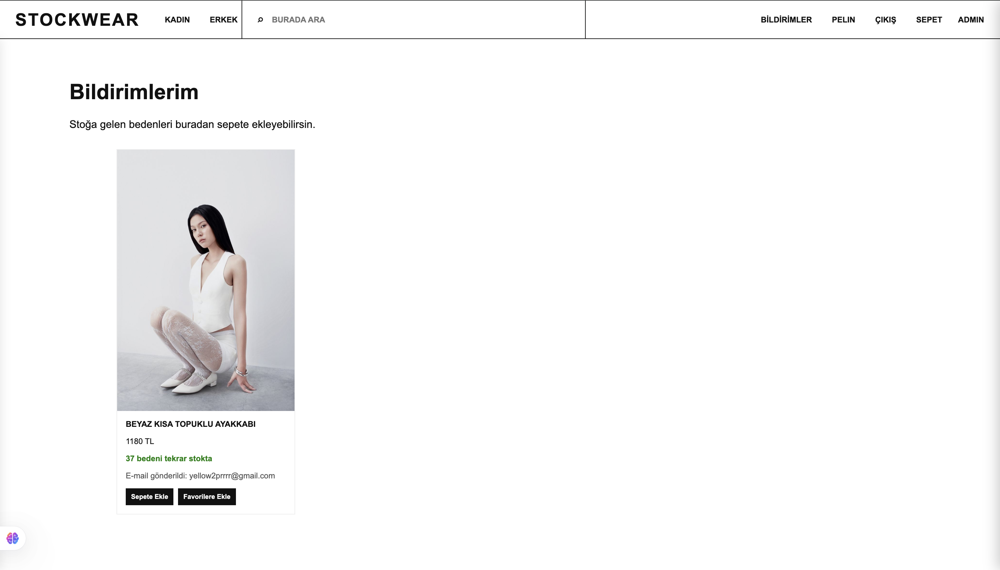

# Product Stock Alert Notification System

A product stock alert notification system built with **Node.js, Express, RabbitMQ, Docker** and **Publish/Subscribe architecture**.

This project simulates an e-commerce stock notification system. Users can browse products, add items to favorites or cart, subscribe to unavailable products, and receive notifications when a product is back in stock.

## Features

* Product listing by category
* Product search
* Add products to cart
* Add products to favorites
* User login/register flow
* Stock tracking system
* Restock notification page
* Admin stock update flow
* RabbitMQ-based event system
* Publish/Subscribe architecture
* Docker-based RabbitMQ setup

## Technologies Used

* JavaScript
* Node.js
* Express.js
* RabbitMQ
* Docker
* HTML
* CSS

## Architecture

This project uses a **Publish/Subscribe architecture**.

* **Publisher:** Sends a stock update event when a product is restocked.
* **RabbitMQ:** Receives and distributes stock update events.
* **Exchange:** Broadcasts restock events to subscribers.
* **Subscriber:** Listens for stock events and processes notifications.
* **Express Server:** Handles product pages, cart actions, user actions and admin operations.

This structure makes the project more scalable than a simple direct function call system because stock updates and notifications are handled through an event-driven message broker.

## Screenshots

### Home Page

The home page shows the main category-based shopping interface of the STOCKWEAR application.



### Product Listing

Users can browse products by category, view stock information, add products to favorites, and add items to the cart.


### Search Results

Users can search for products by keyword and view matching results.



### Cart Page

Users can view selected products, update quantities, and see the total order price.



### Stock Notification Page

Users can see restocked products and receive notification information when an out-of-stock item becomes available again.



## How to Run

### 1. Clone the repository

```bash
git clone https://github.com/kingp4-cmyk/product-stock-alert-rabbitmq.git
cd product-stock-alert-rabbitmq
```

### 2. Install dependencies

```bash
npm install
```

### 3. Start RabbitMQ with Docker

```bash
docker run -d --name rabbitmq-stock-alert -p 5672:5672 -p 15672:15672 rabbitmq:3-management
```

If the container already exists, start it with:

```bash
docker start rabbitmq-stock-alert
```

### 4. Run the application

```bash
node server.js
```

### 5. Open the app

```txt
http://localhost:3000
```

RabbitMQ Management Panel:

```txt
http://localhost:15672
```

Default RabbitMQ login:

```txt
username: guest
password: guest
```

## What I Learned

While building this project, I learned:

* How Publish/Subscribe architecture works
* How RabbitMQ is used as a message broker
* How to publish and consume events in Node.js
* How to use Docker for running RabbitMQ
* How to structure a simple event-driven notification system
* How backend systems can separate product actions from notification logic

## Project Scope

This project was developed as a full-stack stock alert notification system. It includes the user interface, product listing, cart flow, stock notification logic, RabbitMQ event handling, Docker setup and backend routing.

